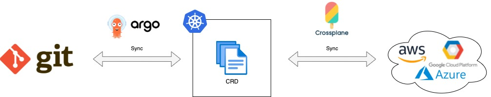
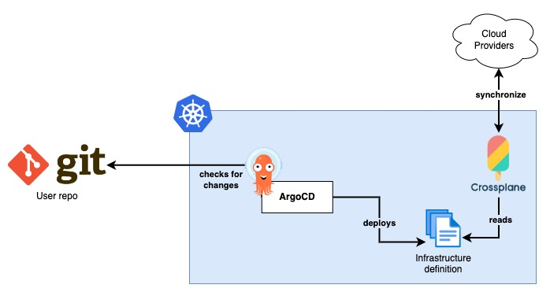

# 1. GitOps

## Description
These are the core components of the platform.

The main goals of these components are:
- Provide a single interface (a Git repository) to provide new infrastructure.
- Use a Git repository as the source of truth and to reflect the current infrastructure state.
- Leverage Git features to manage change permissions, compare and audit changes, and easily revert changes. 
- Provide an infrastructure state control to avoid configuration drifts.
- Automate infrastructure provision.
- Allow teams to create custom infrastructure compositions.



## Platform architecture



### Tech stack

#### Base components
- **Kubernetes:** base platform on which we will build the Infrastructure Platform.

Only for local testing:
- **LocalStack:** this tool emulates AWS cloud provider.
- **Microk8s & multipass or Colima:** tool used to spin up a local Kubernetes cluster.

#### GitOps components
- **Git User repository:** a source code repository that will be used for the team to provide new infrastructure. It will also hold the desired state of the infrastructure. (This repository will act as the source of truth for ArgoCD)
- **Crossplane:** this framework allows teams to define infrastructure through Kubernetes CRD and also keep the infrastructure state (in the Cloud provider) synchronized with the desired state defined in those CRD. This framework also allow teams to define their own custom CRD, for example to compose multiple infrastructure components in a single Kubernetes CRD. In other words, it will be responsible to deploy new infrastructure into the Cloud Provider and maintain synchronization between current state and the desired state.
- **ArgoCD:** continuous deployment tool that will be used to synchronize the resources deployed in Kubernetes with all the infrastructure definition files stored in the Git repository.

## Requirements
- Kubernetes cluster [v1.23+]
- kubectl [v1.23+]
- helm [v3+]
- Crossplane [v1.9.0+]
- ArgoCD [v2.4.9+]

## Instructions
### Local environment
#### Start Kubernetes
1. Install `microk8s` ([Instructions](https://microk8s.io/docs/install-alternatives)).
2. Start a new Kubernetes cluster:
```sh
microk8s install --cpu 4 --mem 8 --disk 50
```
3. Configure local kubeconfig file:
```sh
microk8s config >> .kube/config
```
4. Test if you can access the cluster:
```sh
kubectl get nodes
```
5. Enable DNS and Helm into the cluster:
```sh
microk8s enable dns helm3
```


#### Deploy LocalStack
1. Create a `localstack` Namespace:
```sh
kubectl create ns localstack
```
2. Deploy LocalStack:
```sh
helm repo add localstack-repo https://helm.localstack.cloud
helm repo update
helm upgrade --install localstack localstack-repo/localstack -n localstack
```
> By default, credentials to access LocalStack API are `test/test`.


### Provision components
#### ArgoCD
1. Deploy ArgoCD following:
```sh
kubectl create namespace argocd

kubectl apply -n argocd -f https://raw.githubusercontent.com/argoproj/argo-cd/stable/manifests/install.yaml
```

#### Crossplane
1. Deploy Crossplane to Kubernetes:
```sh
kubectl create namespace crossplane-system

helm repo add crossplane-stable https://charts.crossplane.io/stable
helm repo update

helm install crossplane --namespace crossplane-system crossplane-stable/crossplane
```
2. Deploy Crossplane [`Provider`](../../providers/aws/provider.yaml) for AWS. When deployed, Crossplane will install all CRDs that will be needed to deploy infrastructure.
3. Configure a [`ProviderConfig`](../../providers/aws/config.yaml) to tell Crossplane how to connect to the Cloud provider. (In this case AWS mocked with LocalStack)


### Configure ArgoCD
1. Open a port forwarding connection to ArgoCD UI:
```sh
kubectl port-forward svc/argocd-server -n argocd 8080:443
```
2. Login as admin. You can get the initial password with:
```sh
kubectl -n argocd get secret argocd-initial-admin-secret -o jsonpath="{.data.password}" | base64 -d; echo
```
3. Create a new Project and configure it to allow deployments of any kind of resources in any cluster, and from any repository.
4. Configure a Repository pointing to the user's repository.
5. Create a new Application. Configure this new Application to listen the repository where the team will upload the Cloud Service definitions that want to deploy.

### Deploy infrastructure


## Conclusions
### Roles needed
- Platform maintainers: They are responsible to maintain the Platform Control Plane. That means that they need to patch and update the Kubernetes cluster, ArgoCD and Crossplane deployments, and cluster RBAC. They will be also in charge of creating new Argo Applications.
- Users: They will create and maintain Cloud Infrastructure YAMLs (Crossplane definitions) in the Git repository.

### Chicken-egg problem
To build this platform you need an Ops team that in first place creates the Kubernetes cluster and deploys all the Platform Control Plane (Crossplane, ArgoCD etc.). This team would need solutions like Terraform and maybe other CI/CD tools, that is what this platform tries to replace.

So solutions like this, cannot fully replace tools like Terraform, but can make things easier for teams that need infrastructure on demand. This solution is a clear example of an [Engineering Platform](https://www.thoughtworks.com/en-es/insights/articles/infrastructure-as-product).

### When this complexity is worth it?
When we want to avoid bottlenecks on the infrastructure provisioning. This is a self-service platform where each team can request infra on their own.

To make this more accessible to non-Ops teams, custom CRD can be created to use more friendly words and to simplify the parameters they need to specify (by setting some default values).

For example, to instantiate VMs in AWS, Platform teams could create 3 new definitions "VMHigh", "VMMedium" and "VMLow", where the only parameters required could be for example only the VM name and the hostname.
These resources could create EC2 instances using different tiers and set other parameters by default.

### It can be used for no-Ops teams?
As said before, this platform can be used for non-Ops teams. It depends on the level of abstraction from the custom CRDs available.

Since this platform can manage any resource from the Cloud provider, it could also be used to deploy non infrastructure resources (e.g. containers inn a CaaS service).

### What Cloud models support?
At this moment Crossplane only has _Providers_ for the most used Public Cloud providers. [See here](https://crossplane.io/docs/v1.9/concepts/providers.html)

### Where are permissions defined?
A service account should be created in the Cloud provider for each team. Those accounts would hold the permissions that define what operations the team members can perform against the Cloud.

Also, a _ProviderConfig_ with the account credentials should be defined to be used in the Crossplane resources. 

Then each team on their repositories, should filter what team members can push commits to master, and use PR reviews techniques to verify what is going to be deployed and who can approve the change.

### Can this architecture be simplified?
_(Reflection needed)_

### What's the best way to handle different environments?
_(Reflection needed)_

### Pros & Cons
#### Pros
- Teams can request new infra or changes on their own (self-service).
- No other teams approvals required. Permissions are defined by RBAC in the Cloud provider per team, and only the desired team members can push changes to master.
- Custom resources can be created to make it very simple to users without Ops knowledge to deploy Cloud resources or groups of Cloud resources, with a single YAML definition.
_(Reflection needed)_

#### Cons
- ArgoCD Applications cannot be created to point a path in the repository that doesn't exist. So for example if you want an `Application` listening for a path called `staging`, first you have to create the folder into the repository with some content, and then you will be able to configure the `Application` in ArgoCD.
- User input is not validated. This means a user can upload wrong YAML definitions and break production infra.
- Some Cloud provider features can be missing in its Crossplane _Provider_. This can be an issue if you need to use new features or some specific ones that Crossplane is not supporting yet.
_(Reflection needed)_
