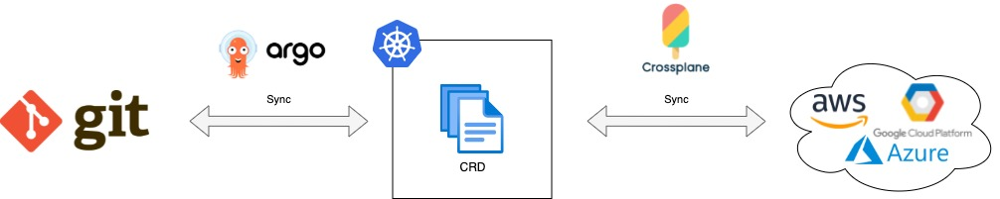
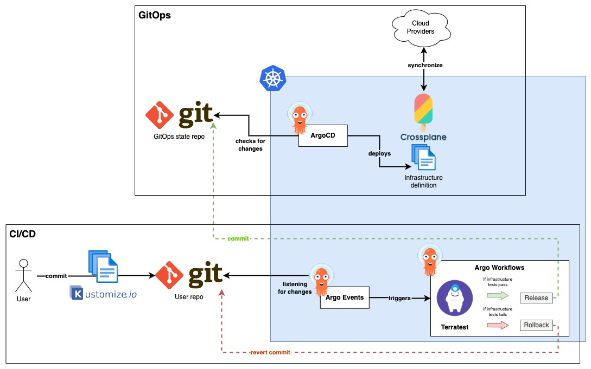

# Infrastructure as Service Platform
```toc
```

## Introduction
This is a Proof of Concept (PoC) with the objective of building a Platform that serves Cloud Infrastructure on demand in a GitOps fashion.

The main goals of this platform are:
- Provide a single interface (a Git repository) to provide new infrastructure.
- Use a Git repository as the source of truth and to reflect the current infrastructure state.
- Leverage Git features to manage change permissions, compare and audit changes, and easily revert changes. 
- Provide an infrastructure state control to avoid configuration drifts.
- Automate infrastructure provision.
- Allow teams to create custom infrastructure compositions.



## Platform architecture

### Main Components

- **GitOps:** ArgoCD, Crossplane
- **CI/CD:** Argo Events, Argo Workflows, Terratest
- **Templating:** Kustomize

### Diagram


### Tech stack

#### Base components
- **Kubernetes:** base platform on which we will build the Infrastructure Platform.

Only for local testing:
- **LocalStack:**
- **Microk8s & multipass or Colima:** 

#### GitOps
- **Git GitOps state repository:** a source code repository that will hold the desired state of the infrastructure. This repository will act as the source of truth for ArgoCD.
- **Crossplane:** this framework allows teams to define infrastructure through Kubernetes CRD and also keep the infrastructure state synchronized with the desired state defined in those CRD. This framework also allow teams to define their own CRD, for example to compose multiple infrastructure components in a single Kubernetes CRD. It will be used to deploy new infrastructure into the Cloud Provider and maintain synchronization between current state and the desired state.
- **ArgoCD:** continuous deployment tool that will be used to synchronize the resources deployed in Kubernetes with all the infrastructure definition files stored in the Git repository.

#### CI/CD
- **Git User repository:** a source code repository that will be used for the Ops team to provision new infrastructure.
- **Argo Events:** it's an event-driven workflow automation framework, that will be looking for changes in the resources deployed in Kubernetes and on any change, trigger a pipeline to test if the infrastructure is deployed successfully.
- **Argo Workflow:** is a workflow engine for orchestrating parallel jobs on Kubernetes, that will run when triggered, a pipeline that will test if the deployed infrastructure is deployed successfully and in case of failure run a "revert commit" into Git to revert last changes.
- **Terratest:** a testing framework based in GoLang, used to write all the infrastructure tests.

#### Templating
- **Kustomize:** it's a simple Kubernetes framework for resource definition templating. It allows to overlay templates in layers, enabling Ops teams to use Trunk-based Development without duplicating code and not being worried about breaking other environments. For example, you can use a shared template for all environments, and promote new changes into each environment one by one, using one overlaying template for each environment.


## Requirements
- Kubernetes cluster v1.22+
- kubectl
- helm

## Instructions
### Local environment
1. Install `microk8s` ([Instructions](https://microk8s.io/docs/install-alternatives)).
2. Start a new Kubernetes cluster:
```sh
microk8s install --cpu 4 --mem 8 --disk 50
```
3. Configure local kubeconfig file:
```sh
microk8s config >> .kube/config
```
4. Test if you can access the cluster:
```sh
kubectl get nodes
```
5. Enable DNS and Helm into the cluster:
```sh
microk8s enable dns helm3
```

### Platform
#### ArgoCD
1. Deploy ArgoCD following:
```sh
kubectl create namespace argocd

kubectl apply -n argocd -f https://raw.githubusercontent.com/argoproj/argo-cd/stable/manifests/install.yaml
```
**ARM64 Workarround**
Replace all the ArgoCD Docker images tags with `latest`:
```sh
kubectl patch deploy -n argocd argocd-server --type='json' \
  -p='[{"op": "replace", "path": "/spec/template/spec/containers/0/image", "value": "quay.io/argoproj/argocd:latest"}]'

kubectl patch deploy -n argocd argocd-repo-server --type='json' \
  -p='[{"op": "replace", "path": "/spec/template/spec/containers/0/image", "value": "quay.io/argoproj/argocd:latest"}, {"op": "replace", "path": "/spec/template/spec/initContainers/0/image", "value": "quay.io/argoproj/argocd:latest"}]'

kubectl patch statefulset -n argocd argocd-application-controller --type='json' \
  -p='[{"op": "replace", "path": "/spec/template/spec/containers/0/image", "value": "quay.io/argoproj/argocd:latest"}]'

kubectl patch deploy -n argocd argocd-dex-server --type='json' \
  -p='[{"op": "replace", "path": "/spec/template/spec/initContainers/0/image", "value": "quay.io/argoproj/argocd:latest"}]'
```

#### LocalStack
1. Create a `localstack` Namespace:
```sh
kubectl create ns localstack
```
2. Deploy LocalStack:
```sh
helm repo add localstack-repo https://helm.localstack.cloud
helm repo update
helm upgrade --install localstack localstack-repo/localstack -n localstack
```
> By default, credentials to access LocalStack API are `test/test`.

#### Crossplane
1. Deploy Crossplane to Kubernetes:
```sh
kubectl create namespace crossplane-system

helm repo add crossplane-stable https://charts.crossplane.io/stable
helm repo update

helm install crossplane --namespace crossplane-system crossplane-stable/crossplane
```
2. Deploy Crossplane [`Provider`](../providers/aws/provider.yaml) for AWS. When deployed, Crossplane will install all CRDs that will be needed to deploy infrastructure.
3. Configure a [`ProviderConfig`](../providers/aws/config.yaml) to tell Crossplane how to connect to the Cloud provider. (In this case AWS mocked with LocalStack)

#### Argo Events
1. Create a Namespace called `argo-events`:
```sh
kubectl create ns argo-events
```
2. Deploy Argo Events:
```sh
helm install argo-events argo/argo-events -n argo-events
```
3. Create a `ServiceAccount` with permissions to trigger `Workflows` ([Instructions](https://github.com/argoproj/argo-events/tree/master/examples)).

#### Argo Workflows
1. Create Namespace called `argo`:
```sh
kubectl create ns argo
```
2. Deploy Argo Workflows:
```sh
kubectl apply -n argo -f https://raw.githubusercontent.com/argoproj/argo-workflows/master/manifests/install.yaml
```

### Example team's repository
1. Open a port forwarding connection to ArgoCD UI:
```sh
	kubectl port-forward svc/argocd-server -n argocd 8080:443
```
2. Login as admin. You can get the initial password with:
```sh
kubectl -n argocd get secret argocd-initial-admin-secret -o jsonpath="{.data.password}" | base64 -d; echo
```
3. Create a new Project and configure it to allow deployments of any kind of resources in any cluster, and from any repository.
4. Configure a Repository pointing to the team's repository.
6. Create a new Application. Configure this new Application to listen the repository where the team will upload the Cloud Service definitions that want to deploy.

## Conclusions
### Roles needed
- Platform maintainers: They are responsible to maintain the Platform Control Plane. That means that they need to patch and update the Kubernetes cluster, Argo's suite deployment, Crossplane deployment and cluster RBAC.
- Infrastructure operators: They are in charge of creating new repositories, Argo Applications, and create and maintain Cloud Infrastructure YAML (Crossplane) definitions.

### Chicken-egg problem
To build this platform you need an Ops team that in first place creates the Kubernetes cluster and deploys all the Platform Control Plane (Crossplane, Argo suite, etc.). This team would need solutions like Terraform and maybe other CI/CD tools, that is what this platform tries to replace.

Possible solutions:
_(Reflection needed)_

### When this complexity is worth it?
_(Reflection needed)_

### Can this architecture be simplified?
_(Reflection needed)_

### It can be used for noOps teams?
As this project could be also used to manage any kind of Cloud services instead only Cloud infrastructure, it could make sense that also Developer teams use it to provision their Cloud services.

_(Reflection needed)_

### What Cloud models support?
_(Reflection needed)_

### Pros & Cons
#### Pros
_(Reflection needed)_

#### Cons
- ArgoCD Applications cannot be created before the repository path it is listening. So for example if you want an `Application` listening for a path called `staging`, first you have to create the folder into the repository with some content, and then you will be able to deploy the `Application` into the cluster.
_(Reflection needed)_
